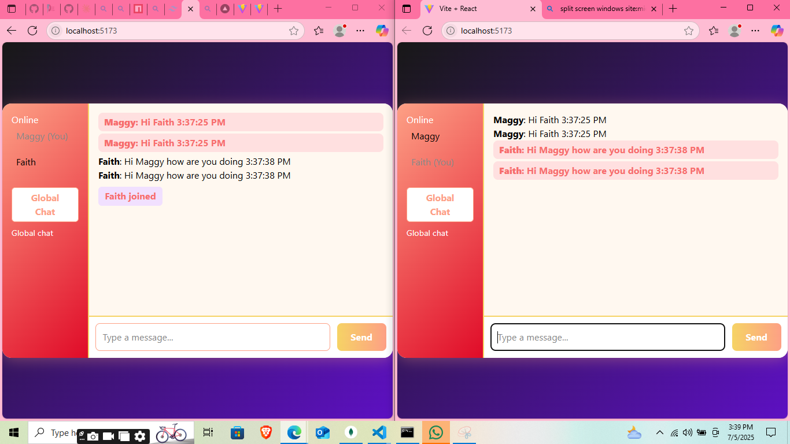

# MY SOCKET.IO PROJECT


## What This Project Does
This is a real-time chat application built with React, Node.js, Express, and Socket.io. It allows users to:
- Join a global chat room or chat privately with any online user
- See who is online in real time
- Send and receive instant messages (public and private)
- See typing indicators and notifications when users join or leave
- Enjoy a modern, colorful, and responsive chat interface

## How It Works
- The **server** (Node.js + Express + Socket.io) manages user connections, broadcasts messages, and handles private messaging by mapping usernames to socket IDs.
- The **client** (React) connects to the server, displays online users, and lets you select a user for private chat or chat with everyone in the global room.
- Messages are sent instantly using WebSockets. Private messages are only visible to the sender and receiver.
- The UI is lively and modern, with support for multi-line messages (Shift+Enter for new line, Enter to send).

## Project Structure
```
MY WORK/
├── client/
│   ├── .gitignore
│   ├── eslint.config.js
│   ├── index.html
│   ├── package-lock.json
│   ├── package.json
│   ├── README.md
│   ├── vite.config.js
│   ├── public/
│   │   └── vite.svg
│   └── src/
│       ├── App.css
│       ├── App.jsx
│       ├── index.css
│       ├── main.jsx
│       ├── sockect.js
│       └── assets/
│           └── react.svg
├── server/
│   ├── .env
│   ├── index.js
│   ├── package-lock.json
│   └── package.json
```

